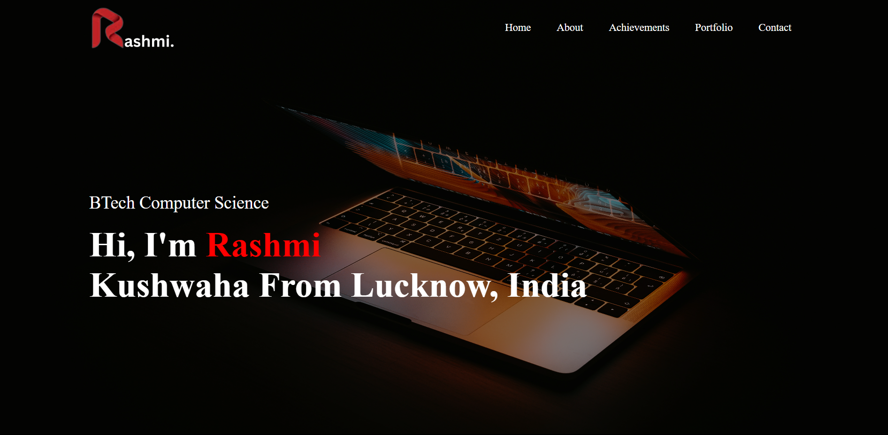

# 🌟 Personal Portfolio Website

A modern, responsive portfolio website to showcase my skills, projects, and professional journey as a BTech Computer Science student.

## 🚀 Features

- **Responsive Design** - Works on all devices (desktop, tablet, mobile)
- **Interactive Elements**:
  - Tab system for About section
  - Project cards with hover effects
  - Smooth scrolling navigation
- **Functional Contact Form** - Connected to Google Sheets
- **Downloadable CV** - Easy access to resume

## 🛠 Technologies Used

- **Frontend**: HTML5, CSS3, JavaScript
- **Styling**: CSS Variables, Flexbox, Grid
- **Icons**: Font Awesome
- **Form Handling**: Google Apps Script

